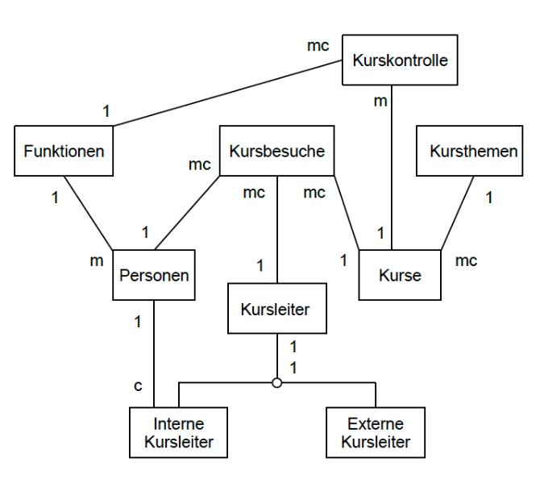
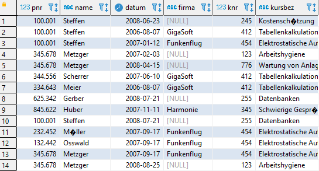
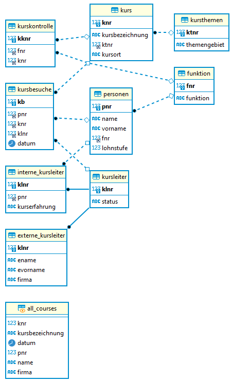

# Ex09

## Aufgaben

### 1
Es soll das folgende Schema erstellt werden.

    person (pnr, name, vorname, fnr, lohnstufe)
    funktion (fnr, funktion)
    kurs (knr, kursbezeichnung, ktnr, kursort)
    kursthemen (ktnr, themengebiet)
    kursleiter (klnr, status)
    externe_kursleiter (klnr, ename, evorname, firma)
    interne_kursleiter (klnr, pnr, kurserfahrung)
    kursbesuche (pnr, knr, klnr, datum)
    kurskontrolle (fnr, knr)

### 2 
Daten einfügen.

### 3
all_courses:

### 4
erd:

## Script
	DROP SCHEMA IF EXISTS ex09;

	CREATE SCHEMA `ex09` DEFAULT CHARACTER SET utf8mb4 ;
	USE ex09;

	CREATE TABLE `personen` (
	`pnr` INTEGER(6) NOT NULL,
	`name` VARCHAR(20) NOT NULL,
	`vorname` VARCHAR(15) NOT NULL,
	`fnr` INTEGER(2) NOT NULL,
	`lohnstufe` INTEGER(1) NOT null,
	PRIMARY KEY (`pnr`)
	) ENGINE=InnoDB DEFAULT CHARSET=utf8mb4;
	
	CREATE TABLE `themen` (
	`ktnr` INTEGER(2) NOT NULL,
	`themengebiet` VARCHAR(45) NOT NULL,
	PRIMARY KEY (`ktnr`)
	) ENGINE=InnoDB DEFAULT CHARSET=utf8mb4;
	
	CREATE TABLE `kurs` (
	`knr` INTEGER(11) NOT NULL,
	`kursbez` VARCHAR(45) not NULL,
	`ktnr` INTEGER(11) NOT NULL,
	`kursort` VARCHAR(45) NOT NULL,
	PRIMARY KEY (`knr`)
	) ENGINE=InnoDB DEFAULT CHARSET=utf8mb4;
	
	CREATE TABLE `kursleiter` (
	`klnr` INTEGER(2) NOT NULL,
	`status` VARCHAR(1) NOT NULL,
	PRIMARY KEY (`klnr`),
	constraint s_check
	check (status ='I'or status='E')
	) ENGINE=InnoDB DEFAULT CHARSET=utf8mb4;
	
	CREATE TABLE `funktion` (
	`fnr` INTEGER(2) NOT NULL,
	`funktion` VARCHAR(45) NOT null,
	PRIMARY KEY (`fnr`)
	) ENGINE=InnoDB DEFAULT CHARSET=utf8mb4;
	
	CREATE TABLE `extern` (
	`klnr` INTEGER(11) NOT NULL,
	`ename` VARCHAR(45) NOT NULL,
	`evorname`VARCHAR(45)NOT NULL,
	`firma`VARCHAR(45)NOT NULL,
	PRIMARY KEY (`klnr`)
	) ENGINE=InnoDB DEFAULT CHARSET=utf8mb4;
	
	CREATE TABLE `intern` (
	`klnr` INTEGER(11) NOT NULL,
	`pnr` INTEGER(45) NOT NULL,
	`kursxp` VARCHAR(45) NOT NULL,
	PRIMARY KEY (`klnr`)
	) ENGINE=InnoDB DEFAULT CHARSET=utf8mb4;
	
	CREATE TABLE `kontrolle` (
	`kknr` INTEGER(11) NOT NULL,
	`fnr` INTEGER(11) NOT NULL,
	`knr` INTEGER(11) NOT NULL,
	PRIMARY KEY (`kknr`)
	) ENGINE=InnoDB DEFAULT CHARSET=utf8mb4;
	
	CREATE TABLE `besuche` (
	`kb` INTEGER(11) NOT NULL,
	`pnr` INTEGER(11) NOT NULL,
	`knr` INTEGER(11) NOT NULL,
	`klnr` INTEGER(11) NOT NULL,
	`datum` DATE NOT NULL,
	PRIMARY KEY (`kb`)
	) ENGINE=InnoDB DEFAULT CHARSET=utf8mb4;
	
	insert into personen (pnr,name,vorname,fnr,lohnstufe) values
	(100001, 'Steffen', 'Felix', 3, 5),
	(232452, 'M�ller', 'Hugo', 1, 1),
	(334643, 'Meier', 'Hans', 2, 5),
	(567231, 'Schmid', 'Beat', 3, 4),
	(345727, 'Steiner', 'Ren�', 5, 5),
	(233456, 'M�ller', 'Franz', 4, 7),
	(132442, 'Osswald', 'Kurt', 1, 2),
	(345678, 'Metzger', 'Paul', 1, 1),
	(344556, 'Scherrer', 'Daniel', 2, 4),
	(845622, 'Huber', 'Walter', 4, 8),
	(625342, 'Gerber', 'Roland', 3, 4);
	
	insert into themen(ktnr,themengebiet)
	values(1 , 'Sicherheit und Umweltschutz'),
	(2, 'F�hrung und Zusammenarbeit'), 
	(3, 'PC-Kurse'), 
	(4, 'Arbeitstechnik'),
	(5, 'Projekte'),
	(6, 'Schulung') ;
	
	insert into kurs(knr,kursbez ,kursort,ktnr)
	values(123 , 'Arbeitshygiene', '2510.EG.25',1),
	(562, 'F�hren einer Gruppe', '1010.4.08',2), 
	(234, 'Pr�sentationstechnik', '1010.4.08',4), 
	(341, 'Textverarbeitung', '2015.1.10',3),
	(245 , 'Kostensch�tzung', '1010.2.05',5),
	(412 , 'Tabellenkalkulation', '2015.1.10',3),
	(454 , 'Elektrostatische Aufladung', '4001.EG.20',1),
	(255 , 'Datenbanken', '2510.2.05',3),
	(455 , 'Terminplanung', '1010.4.08',5),
	(345 , 'Schwierige Gespr�che f�hren', '1010.2.05',2),
	(283 , 'Abfallentsorgung', '4001.EG.20',1),
	(776 , 'Wartung von Anlagen', '1010.2.05',4); 
	
	insert into  kursleiter(klnr,status) values
	(1,'I'),
	(2,'E'),
	(3,'I'),
	(4,'I'),
	(5,'E'),
	(6,'I'),
	(7,'E'),
	(8,'E');
	
	insert into funktion (fnr,funktion) values
	(1, 'Vorarbeiter'),
	(2, 'Meister'),
	(3, 'Chemiker'),
	(4, 'Bereichsleiter'),
	(5, 'Informatiker');
		
	insert into  extern(klnr,ename,evorname,firma) values
	(2,'Suter','Rolf','GigaSoft'),
	(5,'Vogt','Peter','Quasar'),
	(7,'Krieg','Stefan','Funkenflug'),
	(8,'Freundlich','Andreas','Harmonie');
	
	insert into  intern(klnr,pnr,kursxp) values
	(1,345727,3),
	(3,232452,1),
	(4,233456,4),
	(6,845622,3);
	
	insert into  kontrolle(kknr,fnr,knr) values
	(1,1,123),
	(2,2,123),
	(3,3,123),
	(4,4,123),
	(5,2,562),
	(6,3,562),
	(7,4,562),
	(8,3,562),
	(9,5,234),
	(10,3,341),
	(11,3,245),
	(12,4,245),
	(13,2,412),
	(14,3,412),
	(15,1,454),
	(16,2,454),
	(17,3,454),
	(18,4,454),
	(19,3,255),
	(20,3,455),
	(21,4,455),
	(22,4,345),
	(23,1,283),
	(24,2,283),
	(25,3,283),
	(26,1,776),
	(27,2,776),
	(28,5,245);
	
	insert into  besuche(kb,pnr,knr,klnr,datum) values
	(1,100001,245,4,'2008.06.23'),
	(2,100001,412,2,'2006.08.07'),
	(3,100001,454,7,'2007.01.12'),
	(4,345678,123,6,'2007.02.03'),
	(5,345678,776,3,'2008.04.15'),
	(6,344556,412,2,'2007.06.10'),
	(7,334643,412,2,'2006.08.07'),
	(8,625342,255,1,'2008.07.21'),
	(9,845622,345,8,'2007.11.11'),
	(10,100001,255,1,'2008.07.21'),
	(11,232452,454,7,'2007.09.17'),
	(12,132442,454,7,'2007.09.17'),
	(13,345678,454,7,'2007.09.17'),
	(14,345678,123,4,'2008.08.25');
	
	ALTER TABLE ex09.personen ADD CONSTRAINT personen_FK_f FOREIGN KEY (fnr) REFERENCES ex09.funktion(fnr);
	ALTER TABLE ex09.kurs ADD CONSTRAINT kurs_FK_kt FOREIGN KEY (ktnr) REFERENCES ex09.themen(ktnr);
	ALTER TABLE ex09.extern ADD CONSTRAINT extern_FK_k FOREIGN KEY (klnr) REFERENCES ex09.kursleiter(klnr);
	ALTER TABLE ex09.intern ADD CONSTRAINT intern_FK_k FOREIGN KEY (klnr) REFERENCES ex09.kursleiter(klnr);
	ALTER TABLE ex09.intern ADD CONSTRAINT intern_FK_p FOREIGN KEY (pnr) REFERENCES ex09.personen(pnr);
	ALTER TABLE ex09.kontrolle ADD CONSTRAINT kontrolle_FK_f FOREIGN KEY (fnr) REFERENCES ex09.funktion(fnr);
	ALTER TABLE ex09.kontrolle ADD CONSTRAINT kontrolle_FK_k FOREIGN KEY (knr) REFERENCES ex09.kurs(knr);
	ALTER TABLE ex09.besuche ADD CONSTRAINT besuche_FK_k FOREIGN KEY (knr) REFERENCES ex09.kurs(knr);
	ALTER TABLE ex09.besuche ADD CONSTRAINT besuche_FK_kl FOREIGN KEY (klnr) REFERENCES ex09.kursleiter(klnr);
	ALTER TABLE ex09.besuche ADD CONSTRAINT besuche_FK_p FOREIGN KEY (pnr) REFERENCES ex09.personen(pnr);
		
	create or replace view all_courses
	as select
	    k2.pnr,
	    p.name,
	    k2.datum,
	    ek.firma,
	    k.knr,
	    k.kursbez
	    
	from
	    ex09.besuche k2
	inner join ex09.personen p on
	    p.pnr = k2.pnr
	inner join ex09.kursleiter k3 on
	    k3.klnr = k2.klnr
	left join ex09.extern ek on
	    k3.klnr = ek.klnr
	inner join ex09.kurs k on
	    k.knr = k2.knr;
	 
	  select*from all_courses;
	
