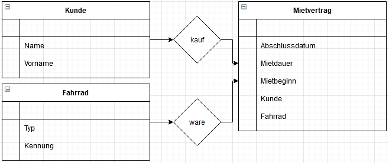
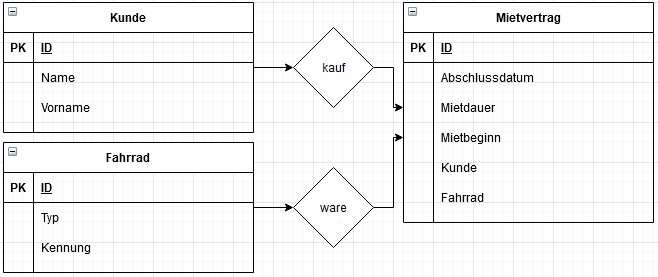
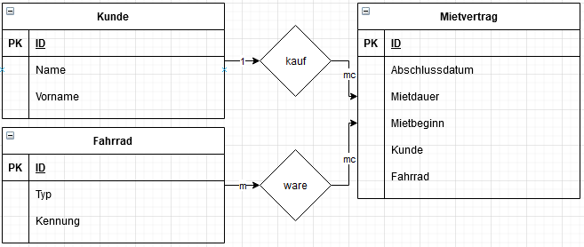
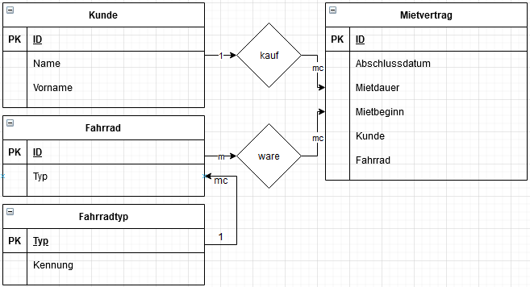
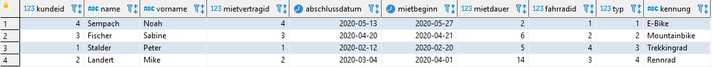

# Ex12

## Aufgaben

### 1

Es soll das folgende Schema erstellt werden.

DieFahrrad Müller GmbHvermietet Fahrräder.
In ihrem Angebot finden sich verschiedene Typen wie zum Beispiel Mountainbikes, Trekkingräder, Rennräderund E-Bikes. 
Jede Vermietung erfasst das Unternehmen in einer Software, die die Daten mit Hilfe einer relationalen Datenbank verwaltet.

Beispielhaft ist folgender Geschäftsvorfall:

Am 11.08.2020 schliesst Max Maier den Mietvertrag für ein Mountainbike und ein Trekkingrad.
Es wird vereinbart, dass der Mietzeitraum am nächsten Tag beginnt und drei Tage dauert.
Der Angestellte ruft über die Software eine Liste aller Mountainbikes auf und ordnet dem Mietvertrag das Fahrrad mit der Kennung Cross#7 zu.
Anschliessend ruft er eine Liste aller Trekkingräderauf und ordnet dem Mietvertrag noch das Fahrrad mit der Kennung Mark#2 zu.

### 2

Welche Informationsobjekte (Personen, Sachen, Vorgänge, ...) spielen in dem Geschäftsvorfall eine Rolle?

- Mietvertrag
    - Mietbeginn
    - Mietdauer
    - Abschlussdatum
    - Kunde
    - Fahrrad
- Kunde
    - Vorname
    - Name
- Fahrrad
    - Typ
    - Kennung

### 3

ERD erstellen:

### 4

Primärschlüssel hinzufügen

### 5

Kardinalitäten hinzufügen

Entität Fahrradtyp

Relationen

mietvertrag(<ins>mietvertragid</ins>, abschlussdatum, mietdauer, mietbeginn, ^kunde, ^fahrrad) 
kunde(<ins>kundeid</ins>, name, vorname) 
fahrrad(<ins>fahrradid</ins>, ^typ) 
fahrradtyp(<ins>fahrradtypid</ins>, kennung)

### 6

Script

    DROP SCHEMA IF EXISTS ex12;

    CREATE SCHEMA `ex12` DEFAULT CHARACTER SET utf8mb4 ;
    USE ex12;

    CREATE TABLE `mietvertrag` (
    `mietvertragid` INTEGER(11) NOT NULL,
    `abschlussdatum` DATE NOT NULL,
    `mietdauer` INTEGER(11) NOT NULL,
    `mietbeginn` DATE NOT NULL,
    `kunde` INTEGER(11) NOT NULL,
    `fahrrad` INTEGER(11) NOT NULL,
    PRIMARY KEY (`mietvertragid`)
    ) ENGINE=InnoDB DEFAULT CHARSET=utf8mb4;

    CREATE TABLE `kunde` (
    `kundeid` INTEGER(11) NOT NULL,
    `name` VARCHAR(45) NOT NULL,
    `vorname` VARCHAR(45) NOT NULL,
    PRIMARY KEY (`kundeid`)
    ) ENGINE=InnoDB DEFAULT CHARSET=utf8mb4;

    CREATE TABLE `fahrrad` (
    `fahrradid` INTEGER(11) NOT NULL,
    `typ` INTEGER(11) NOT NULL,
    PRIMARY KEY (`fahrradid`)
    ) ENGINE=InnoDB DEFAULT CHARSET=utf8mb4;

    CREATE TABLE `fahrradtyp` (
    `fahrradtypid` INTEGER(11) NOT NULL,
    `kennung` VARCHAR(45) NOT NULL,
    PRIMARY KEY (`fahrradtypid`)
    ) ENGINE=InnoDB DEFAULT CHARSET=utf8mb4;

    INSERT INTO mietvertrag (mietvertragid, abschlussdatum, mietbeginn, mietdauer, kunde, fahrrad)
    VALUES(1 ,'2020.02.12','2020.02.20',5,1,4),
    (2 ,'2020.03.04','2020.04.01',14,2,3),
    (3 ,'2020.04.20','2020.04.21',6,3,2),
    (4 ,'2020.05.13','2020.05.27',2,4,1);

    INSERT INTO kunde (kundeid, name, vorname)
    VALUES(1 ,'Stalder','Peter'),
    (2 , 'Landert','Mike'),
    (3 , 'Fischer','Sabine'),
    (4 , 'Sempach','Noah');

    INSERT INTO fahrrad (fahrradid, typ)
    VALUES(1 ,1),
    (2 ,2),
    (3 ,4),
    (4 ,3),
    (5 ,2),
    (6 ,4),
    (7 ,3);

    INSERT INTO fahrradtyp (fahrradtypid, kennung)
    VALUES(1 ,'E-Bike'),
    (2 ,'Mountainbike'),
    (3 ,'Trekkingrad'),
    (4 ,'Rennrad');

    ALTER TABLE ex12.mietvertrag ADD CONSTRAINT mietvertrag_FK FOREIGN KEY (kunde) REFERENCES ex12.kunde(kundeid);
    ALTER TABLE ex12.mietvertrag ADD CONSTRAINT mietvertrag_FK2 FOREIGN KEY (fahrrad) REFERENCES ex12.fahrrad(fahrradid);
    ALTER TABLE ex12.fahrrad ADD CONSTRAINT fahrrad_FK FOREIGN KEY (typ) REFERENCES ex12.fahrradtyp(fahrradtypid);

    create or replace view ex12_all
    as select
      k.kundeid,
      k.name,
      k.vorname,
      m.mietvertragid,
      m.abschlussdatum,
      m.mietbeginn,
      m.mietdauer,
      f.fahrradid,
      f.typ,
      f2.kennung
    
    from
      ex12.mietvertrag m
    inner join ex12.kunde k on
      m.kunde = k.kundeid
    inner join ex12.fahrrad f on
      m.fahrrad = f.fahrradid
    inner join ex12.fahrradtyp f2 on
      f.typ = f2.fahrradtypid;
 
      select*from ex12_all;

### 7

Abfrage der Vermietungen mit Kunden, Mietvertrag, Fahrrad und Fahrradtyp

