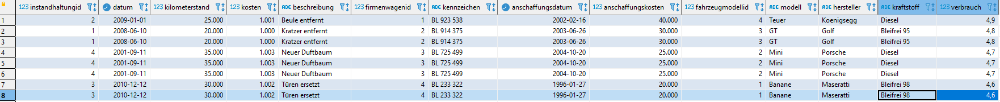

# Ex13

## 1

Aufgabenstellung

Die FirmaAtlanta GmbHhat einen Fuhrpark von Firmenwägen, die von Mitarbeitern für berufliche Zwecke genutzt werden können.
Das Unternehmen möchte die Verwaltung des Fuhrparks, die bislang ausschliesslich in Papierform erfolgt, auf eine IT-gestützte Lösung umstellen.

## 2

Mitarbeiter

- Name
- Vorname
- Personalnummer

Firmenwagen

- Kennzeichen
- Anschaffungsdatum
- Anschaffungskosten

Fahrzeugmodell

- Hersteller
- Modell
- Kraftstoff
- Verbrauch

Instandhaltung

- Datum
- Kilometerstand
- Kosten
- BEschreibung

Reservierung

- Beginn
- Ende
- Zweck

Vertrag

- Versicherungsnummer
- Vollkasko, Teilkasko
- Jahreskosten

Versicherungsgesellschaft

- Name
- Strasse
- Ort
- Land
- Telefonnummer

## 3

ERD erstellen

## 4

mitarbeiter(<ins>mitarbeiterid</ins>, name, vorname, personalnummer) 
firmenwagen(<ins>firmenwagenid</ins>, kennzeichen, anschaffungsdatum, anschaffungskosten, ^fahrzeugmodellid, ^vertragid, ^instandhaltungid) 
fahrzeugmodell(<ins>fahrzeugmodellid</ins>, hersteller, modell, kraftstoff, verbrauch) 
instandhaltung(<ins>instandhaltungid</ins>, datum, kilometer, kosten, beschreibung) 
reservierung(<ins>reservierungid</ins>, beginn, ende, zweck, ^mitarbeiter, ^firmenwagenid) 
vertrag(<ins>wertragid</ins>, versicherungsnummer, kasko, jahreskosten, ^versicherungid) 
versicherung(<ins>versicherungid</ins>, name, strasse, ort, land, telefonnummer)

## 5

reservierungsview:

instandhaltungsview:

versicherungsview:

##Script

    DROP SCHEMA IF EXISTS ex13;

    CREATE SCHEMA `ex13` DEFAULT CHARACTER SET utf8mb4 ;
    USE ex13;

    CREATE TABLE `mitarbeiter`(
    `mitarbeiterid` INTEGER(11) NOT NULL,
    `name` VARCHAR(45) NOT NULL,
    `vorname` VARCHAR(10)NOT NULL,
    `personalnummer`INTEGER(20) NOT NULL,
    PRIMARY KEY (`mitarbeiterid`)
    ) ENGINE=InnoDB DEFAULT CHARSET=utf8mb4;

    CREATE TABLE `firmenwagen` (
    `firmenwagenid` INTEGER(11) NOT NULL,
    `kennzeichen` VARCHAR(45) NOT NULL,
    `anschaffungsdatum` DATE NOT NULL,
    `anschaffungskosten` FLOAT(15) NOT NULL,
    `fahrzeugmodellid`INTEGER(11)NOT NULL,
    `vertragid`INTEGER(11)NOT NULL,
    `instandhaltungid`INTEGER(11)NOT NULL,
    PRIMARY KEY (`firmenwagenid`)
    ) ENGINE=InnoDB DEFAULT CHARSET=utf8mb4;

    CREATE TABLE `fahrzeugmodell` (
    `fahrzeugmodellid` INTEGER(11) NOT NULL,
    `hersteller` VARCHAR(45) NOT NULL,
    `modell` VARCHAR(45) NOT NULL,
    `kraftstoff` VARCHAR(45) NOT NULL,
    `verbrauch` decimal(4,1) NOT NULL,
    PRIMARY KEY (`fahrzeugmodellid`)
    ) ENGINE=InnoDB DEFAULT CHARSET=utf8mb4;

    CREATE TABLE `instandhaltung` (
    `instandhaltungid` INTEGER(11) NOT NULL,
    `datum` DATE NOT NULL,
    `kilometerstand` FLOAT(10) NOT NULL,
    `kosten` FLOAT(11) NOT NULL,
    `beschreibung` VARCHAR(200),
    PRIMARY KEY (`instandhaltungid`)
    ) ENGINE=InnoDB DEFAULT CHARSET=utf8mb4;

    CREATE TABLE `reservierung` (
    `reservierungid` INTEGER(11) NOT NULL,
    `beginn` DATE NOT NULL,
    `ende` DATE NOT NULL,
    `zweck` VARCHAR(45) NOT NULL,
    `mitarbeiterid` INTEGER (11)NOT NULL,
    `firmenwagenid`INTEGER (11)NOT NULL,
    PRIMARY KEY (`reservierungid`)
    ) ENGINE=InnoDB DEFAULT CHARSET=utf8mb4;

    CREATE TABLE `vertrag` (
    `vertragid` INTEGER(11) NOT NULL,
    `versicherungsnummer` INTEGER(20) NOT NULL,
    `kasko` VARCHAR(45) NOT NULL,
    `jahreskosten` FLOAT(15)NOT NULL,
    `versicherungid`INTEGER(11)NOT NULL,
    PRIMARY KEY (`vertragid`)
    ) ENGINE=InnoDB DEFAULT CHARSET=utf8mb4;

    CREATE TABLE `versicherung` (
    `versicherungid` INTEGER(11) NOT NULL,
    `name` VARCHAR(45) NOT NULL,
    `strasse` VARCHAR(45) NOT NULL,
    `ort` VARCHAR(10)NOT NULL,
    `land` VARCHAR(10)NOT NULL,
    `telefonnummer` INTEGER(15) NOT NULL,
    PRIMARY KEY (`versicherungid`)
    ) ENGINE=InnoDB DEFAULT CHARSET=utf8mb4;

    INSERT INTO mitarbeiter (mitarbeiterid, name, vorname, personalnummer)
    VALUES(1 , 'Steiner','Sandra', 100),
    (2 , 'Tischler','Franziska', 101),
    (3 , 'Staller','Timo', 102),
    (4 , 'Mauerer','Ueli', 103);

    INSERT INTO firmenwagen (firmenwagenid, kennzeichen, anschaffungsdatum, anschaffungskosten, fahrzeugmodellid, vertragid, instandhaltungid)
    VALUES(1 , 'BL 923 538', '2002.02.16', '40000', 4, 1, 2),
    (2 , 'BL 914 375', '2003.06.26', '30000', 3, 2, 1),
    (3 , 'BL 725 499', '2004.10.20', '25000', 2, 3, 4),
    (4 , 'BL 233 322', '1996.01.27', '20000', 1, 4, 3);

    INSERT INTO fahrzeugmodell (fahrzeugmodellid, hersteller, modell, kraftstoff, verbrauch)
    VALUES(1 , 'Maseratti', 'Banane', 'Bleifrei 98', 4.6),
    (2 , 'Porsche', 'Mini', 'Diesel', 4.7),
    (3 , 'Golf', 'GT', 'Bleifrei 95', 4.8),
    (4 , 'Koenigsegg', 'Teuer', 'Diesel', 4.9);

    INSERT INTO instandhaltung (instandhaltungid, datum, kilometerstand, kosten, beschreibung)
    VALUES(1 ,'2008.06.10', 20000, 1000, 'Kratzer entfernt'),
    (2 ,'2009.01.01', 25000, 1001, 'Beule entfernt'),
    (3 ,'2010.12.12', 30000, 1002, 'Türen ersetzt'),
    (4 ,'2001.09.11', 35000, 1003, 'Neuer Duftbaum');

    INSERT INTO reservierung (reservierungid, beginn, ende, zweck, mitarbeiterid, firmenwagenid)
    VALUES(1 , '2014.11.06', '2014.11.06', 'Kaffe holen', 1, 2),
    (2 ,'2015.07.30','2015.07.30', 'Waren kaufen', 2, 3),
    (3 ,'2016.10.15','2016.10.20', 'Geschäftsreise', 3, 4),
    (4 ,'2017.02.13','2017.02.13', 'Kundenmeeting', 4, 1),
    (5 ,'2018.08.17','2018.08.17', 'Kaffe holen', 1, 4),
    (6 ,'2019.05.27','2019.06.04', 'Urlaub', 2, 3),
    (7 ,'2020.11.18','2020.11.18', 'Waren kaufen', 2, 3),
    (8 ,'2021.03.12','2021.03.22', 'Geschäftsreise', 3, 2);

    INSERT INTO vertrag (vertragid, versicherungsnummer, kasko, jahreskosten, versicherungid)
    VALUES(1 , 1234, 'Voll kasko', 100, 2),
    (2 , 4321, 'Voll Kasko', 200, 2),
    (3 , 3421, 'Teil Kasko', 300, 1),
    (4 , 1324, 'Teil Kasko', 400, 1);

    INSERT INTO versicherung (versicherungid, name, strasse, ort, land, telefonnummer)
    VALUES(1 , 'Beste', 'Musterstrasse.', 'Basel', 'Schweiz', 0793452859),
    (2 , 'Sicher', 'Fiechtenweg.', 'Zürich', 'Schweiz', 0791452369);

    ALTER TABLE ex13.firmenwagen ADD CONSTRAINT firmenwagen_FK1 FOREIGN KEY (fahrzeugmodellid) REFERENCES ex13.fahrzeugmodell(fahrzeugmodellid);
    ALTER TABLE ex13.firmenwagen ADD CONSTRAINT firmenwagen_FK2 FOREIGN KEY (vertragid) REFERENCES ex13.vertrag(vertragid);
    ALTER TABLE ex13.firmenwagen ADD CONSTRAINT firmenwagen_FK3 FOREIGN KEY (instandhaltungid) REFERENCES ex13.instandhaltung(instandhaltungid);
    ALTER TABLE ex13.reservierung ADD CONSTRAINT reservierung_FK1 FOREIGN KEY (mitarbeiterid) REFERENCES ex13.mitarbeiter(mitarbeiterid);
    ALTER TABLE ex13.reservierung ADD CONSTRAINT reservierung_FK2 FOREIGN KEY (firmenwagenid) REFERENCES ex13.firmenwagen(firmenwagenid);
    ALTER TABLE ex13.vertrag ADD CONSTRAINT vertrag_FK FOREIGN KEY (versicherungid) REFERENCES ex13.versicherung(versicherungid);

    create or replace view reservierungsview
    as select
        r.reservierungid,
        r.zweck,
        r.beginn,
        r.ende,
        m.mitarbeiterid,
        m.personalnummer,
        m.vorname,
        m.name,
        f.firmenwagenid,
        f.kennzeichen,
        f.anschaffungsdatum,
        f.anschaffungskosten,
        f2.fahrzeugmodellid,
        f2.modell,
        f2.hersteller,
        f2.kraftstoff,
        f2.verbrauch
    from
        ex13.reservierung r
    inner join ex13.mitarbeiter m on
        r.mitarbeiterid = m.mitarbeiterid
    inner join ex13.firmenwagen f on
        r.firmenwagenid = f.firmenwagenid
    inner join ex13.fahrzeugmodell f2 on
        f.fahrzeugmodellid = f2.fahrzeugmodellid;

      select*from reservierungsview;

    create or replace view instandhaltungsview
    as select
        i.instandhaltungid,
        i.datum,
        i.kilometerstand,
        i.kosten,
        i.beschreibung,
        f.firmenwagenid,
        f.kennzeichen,
        f.anschaffungsdatum,
        f.anschaffungskosten,
        f2.fahrzeugmodellid,
        f2.modell,
        f2.hersteller,
        f2.kraftstoff,
        f2.verbrauch
    from
      ex13.reservierung r
    inner join ex13.firmenwagen f on
        r.firmenwagenid = f.firmenwagenid
    inner join ex13.instandhaltung i on
      f.instandhaltungid = i.instandhaltungid
    inner join ex13.fahrzeugmodell f2 on
        f.fahrzeugmodellid = f2.fahrzeugmodellid;

      select*from instandhaltungsview;

     create or replace view versicherungsantragview 
    as select
        v.vertragid,
        v.versicherungsnummer,
        v.kasko,
        v.jahreskosten,
        v2.versicherungid,
        v2.name,
        v2.strasse,
        v2.ort,
        v2.telefonnummer
    from
      ex13.reservierung r
    inner join ex13.firmenwagen f on
        r.firmenwagenid = f.firmenwagenid
    inner join ex13.vertrag v on
        f.vertragid = v.vertragid
    inner join ex13.versicherung v2 on
        v.versicherungid = v2.versicherungid;

      select*from versicherungsantragview;
